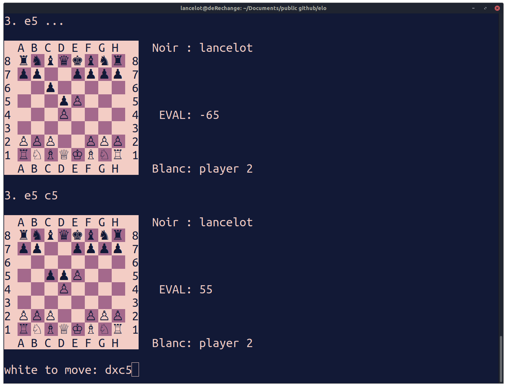

# Chess terminal
Python app to play chess via ssh in the terminal. Supports as many players as possible.

Both players launch clientv2.py and the server socket will launch a new game. 

## To setup
Create a new python env and install the requirements.

 - Launch serverv2.py
 - Then each player need to launch an instacne of clientv2.py

 ## Notes

 This is by no mean complete. Think of it as an interesting proof of concept. At the moment there is no way to resign. When the game ends in mate it is unclear for the player at the exception that all the moves entered are now illegal.

 Originally I set this program on a linux user session that could be accessed via ssh by anyone. When players would log in, an instance of clientv2.py would start making the process seamless.